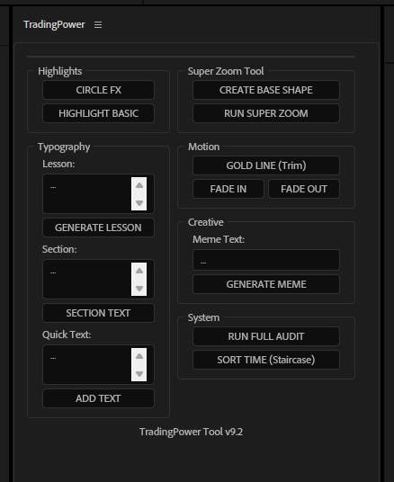

# TradingPower Tool v9.2
[](LICENSE)



**TradingPower Tool** is a ScriptUI Panel for Adobe After Effects that automates the creation of trading and financial education videos. It standardizes brand identity (Bebas Neue fonts, Gold #c18d21 palette) and eliminates repetitive editing tasks.

<!-- Add a demo GIF here:  -->
## Key Features

- **Typography & Titles**: Generate standardized Lesson titles, Section headers, and quick text reveal animations.
- **Dynamic Highlights**: Circle FX reveals and basic highlight presets for charting.
- **Super Zoom Tool**: Intelligent zoom-in/out logic for focal points.
- **Fullscreen Memes**: Quickly generate branded fullscreen overlays with GIF and text integration.
- **Motion Helpers**: Gold line (Trim Paths) drawings and fade animations.
- **Audit System**: Run a full composition audit to ensure consistency with brand guidelines.

## Quick Start for Beginners

1.  **Open AE**: Start Adobe After Effects and your Composition.
2.  **Launch Tool**: Go to `Window > TradingPower.jsx`.
3.  **Try a Title**: Type "Bitcoin Analysis" in the **Lesson** box and click **GENERATE LESSON**.
4.  **Try a Zoom**:
    *   Draw a rectangle over a chart.
    *   Select both the **Rectangle** and your **Video**.
    *   Click **RUN SUPER ZOOM**.

---

## Detailed Manual
- [User Manual (English)](TradingPower_Guidelines_EN.md) - Full documentation of features and troubleshooting.

## Installation

1. Copy `TradingPower.jsx` and the `presets` folder to your After Effects scripts directory:
   `C:\Program Files\Adobe\Adobe After Effects <version>\Support Files\Scripts\ScriptUI Panels\`
2. Restart After Effects.
3. Open the tool from the **Window** menu.

## Dependencies

The tool relies on several After Effects Animation Presets (`.ffx`) located in the `presets` folder. Ensure this folder is kept in the same directory as the script.

- `Highlight_LayerStyles.ffx`
- `FullscreenText_TextLayerStyles.ffx`
> ⚠️ **Do NOT use** `File > Scripts > Install ScriptUI Panel` — it only copies the `.jsx` file and skips the required `presets/` folder.

1. Download or clone this repository.
2. Copy **both** `TradingPower.jsx` **and** the `presets/` folder into your ScriptUI Panels directory:
   - **Windows:** `C:\Program Files\Adobe\Adobe After Effects <version>\Support Files\Scripts\ScriptUI Panels\`
   - **macOS:** `/Applications/Adobe After Effects <version>/Scripts/ScriptUI Panels/`
3. Your folder structure should look like this:
   ```
   ScriptUI Panels/
   ├── TradingPower.jsx
   └── presets/
       ├── Highlight_LayerStyles.ffx
       ├── FullscreenText_TextLayerStyles.ffx
       ├── Screen.ffx
       ├── LoopGIF.ffx
       └── ...
   ```
4. Restart After Effects.
5. Open the tool from **Window → TradingPower.jsx**.

## Quick Start

1. **Create a Title**: Type "Bitcoin Analysis" in the **Lesson** box → click **GENERATE LESSON**.
2. **Try Super Zoom**:
   - Use the Rectangle Tool (**Q**) to draw a shape over a chart area.
   - **Ctrl+Click** to select both the Shape layer and your Video layer.
   - Click **RUN SUPER ZOOM**.
3. **Add a Highlight**: Draw any shape on screen → click **HIGHLIGHT BASIC**.

## Required Presets

The `presets/` folder contains `.ffx` files that the script depends on. **Keep this folder next to the script at all times.**

| Preset | Purpose |
|--------|---------|
| `Highlight_LayerStyles.ffx` | Glow & blend look for highlights |
| `FullscreenText_TextLayerStyles.ffx` | Text style for fullscreen meme frames |
| `Screen.ffx` | Mask shape for Zoom/Meme frame cropping |
| `LoopGIF.ffx` | Enables infinite GIF looping |

## Detailed Manual

→ [User Manual (English)](TradingPower_Guidelines_EN.md) — Full feature guide and troubleshooting.

## Brand Identity

- **Font:** Bebas Neue (Regular & Bold)
- **Primary Color:** Gold `#c18d21`
- **Secondary:** Dark Royal Blue `#102945`, Light Blue `#0c1f34`

## License

This project is licensed under the MIT License — see the [LICENSE](LICENSE) file for details.
